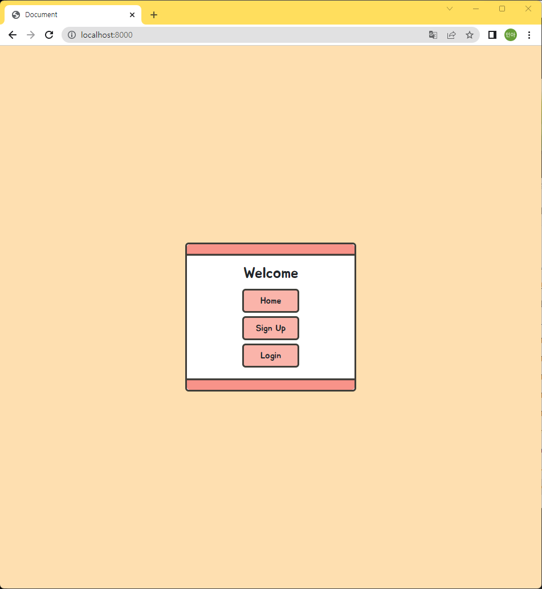
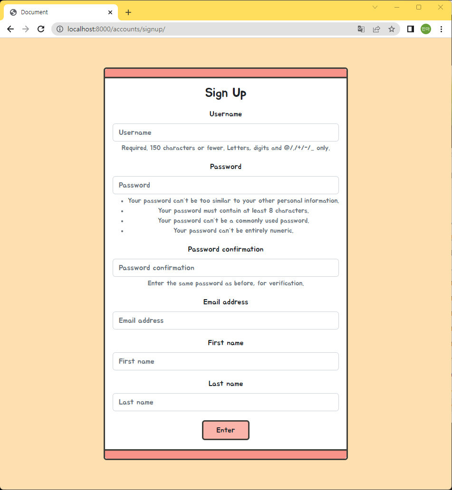
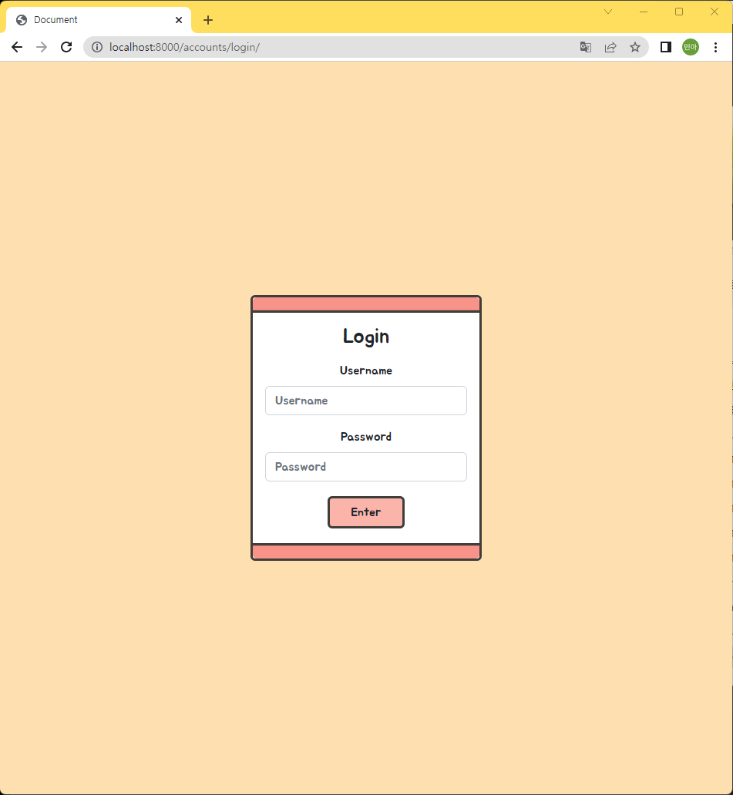
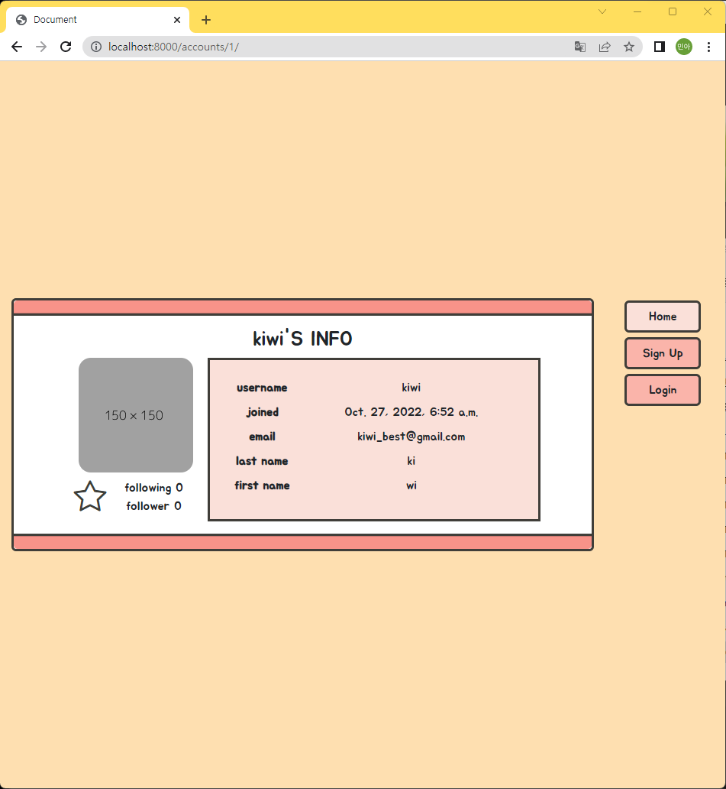
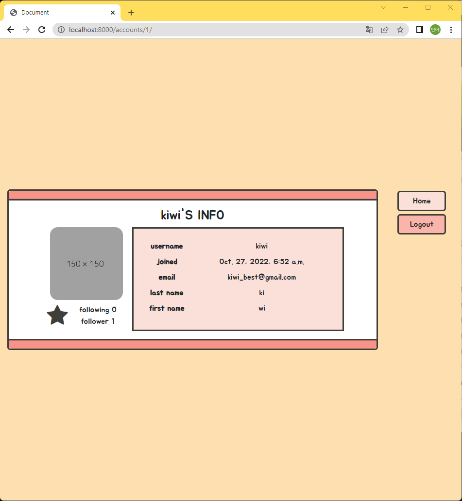

# Django 프로젝트12


### 1. 깃 저장소 생성

#### 1-1. 깃 저장소 생성

- 원격 저장소 생성
- 로컬 저장소 깃 초기화

```bash
$ git init
```

#### 1-2. .gitignore

> https://www.toptal.com/developers/gitignore/

```bash
$ touch .gitignore
```

#### 1-3. commit & push

- commit : `init`
- push : `master`


### 2. 개발환경 설정

#### 2-1. 가상환경 생성 및 실행

> 가상환경 : 프로젝트별 별도 패키지 관리

```bash
# 가상환경 생성
$ python -m venv venv

# 가상환경 폴더 생성 확인
$ ls

# 가상환경 실행
$ source venv/Scripts/activate
(venv)
```

#### 2-2. Django, 추가 패키지 설치 및 기록

> 가상환경 실행한 상태에서 패키지지 설치

```bash
# Django LTS 버전 설치
$ pip install django==3.2.13

# Django-Bootstrap5 설치
$ pip install django-bootstrap5

# Django-Extensions 설치
$ pip install django-extensions

# Pillow 설치
$ pip install Pillow

# PILkit(Pillow 헬퍼) 설치
$ pip install pilkit

# django-imagekit(썸네일 헬퍼 장고 앱) 설치
$ pip install django-imagekit

# 패키지 설치 확인
$ pip list

# 패키지 기록
$ pip freeze > requirements.txt
```

#### 2-3. Django 프로젝트 생성

```bash
# Django 프로젝트 생성
$ django-admin startproject config .

# 프로젝트 폴더 생성 확인
$ ls
```

#### 2-4. 패키지 등록

- `config/settings.py` 파일의 `INSTALLED_APPS`에 추가

```python
INSTALLED_APPS = [
    'django_bootstrap5',
    'django_extensions',
    'imagekit'
    ...
]
```


### 3. Template 및 Static Files 관리

#### 3-1 Templates 설정

- `config/templates` 폴더 생성 후, 템플릿 관리
- `config/settings.py` 파일의 `TEMLATES`의 `DIRS` 추가

```python
TEMPLATES = [
    {
        ...
        'DIRS': [BASE_DIR / 'config' / 'templates'],
        ...
    },
]
```

#### 3-2. STATIC files 설정

- `django.contrib.staticfiles`가 `config/settings.py` 파일의 `INSTALLED_APPS`에 포함되어 있는지 확인

```python
INSTALLED_APPS = [
    ...
    'django.contrib.staticfiles',
]
```

- `config/settings.py` 파일의 `INSTALLED_APPS`에 `STATIC_URL` 설정

```python
STATIC_URL = '/static/'
```

- `config/static/` 폴더 생성 후, 정적 파일 폴더별 관리
- 기본 경로를 제외하고 추가적인 정적 파일 경로 목록 정의 : `STATICFILES_DIRS`

```python
import os

...

STATIC_URL = '/static/'
STATICFILES_DIRS = [os.path.join(BASE_DIR, "config", "static")]
```

- `static/css` 폴더 생성 후, css 파일 관리

#### 3-3. 기본 Templates 관리

- `templates/base.html` 파일 생성

```bash



<!DOCTYPE html>
<html lang="en">

  <head>
    <meta charset="UTF-8">
    <meta http-equiv="X-UA-Compatible" content="IE=edge">
    <meta name="viewport" content="width=device-width, initial-scale=1.0">
    
    
    
    <link rel="stylesheet" href="https://cdn.jsdelivr.net/npm/bootstrap-icons@1.9.1/font/bootstrap-icons.css">
    <link rel="stylesheet" href="">
    <title>Document</title>
  </head>

  <body>
    
  </body>

</html>
```


### 4. 시작 페이지



#### 4-1. URL 설정

- `config/urls.py` 파일에 추가

```python
from django.contrib import admin
from django.urls import path
from . import views

urlpatterns = [
    path('admin/', admin.site.urls),
    path('', views.index, name='index'),
]
```

#### 4-2. View 설정

- `config/views.py` 파일 생성

```python
from django.shortcuts import render

def index(request):

    return render(request, 'index.html')
```

#### 4-3. html 작성

- `config/templates/index.html` 파일 생성

```html




  <div class="min-box m-auto">
    <div class="card text-center bd">
      <div class="card-header color-3"></div>
      <div class="card-body bd-body">
        <h3 class="card-title">Welcome</h3>
        <div class="box">
          <a href="#" class="btn min-btn color-2 bd">Home</a>
          <a href="#" class="btn min-btn color-2 bd">Sing Up</a>
          <a href="#" class="btn min-btn color-2 bd">Login</a>
        </div>
      </div>
      <div class="card-footer color-3"></div>
    </div>
  </div>

```


### 5. accounts App

#### 5-1. App 생성

```bash
# Django 앱 생성
python manage.py startapp accounts
```

#### 5-2. App 등록

- `config/settings.py` 파일의 `INSTALLED_APPS`에 추가

```python
INSTALLED_APPS = [
    'accounts',
    ...
]
```

#### 5-3. URL 설정

> app 단위의 URL 관리

- `config/urls.py` 파일에 추가

```python
from django.contrib import admin
from django.urls import path, include
from . import views

urlpatterns = [
    path('admin/', admin.site.urls),
    path('', views.index, name='index'),
    path('accounts/', include('accounts.urls')),
]
```

- `accounts/urls.py` 파일 생성

```python
from django.urls import path
from . import views

app_name = 'accounts'

urlpatterns = [

]
```

#### 5-4. Templates 관리

- `accounts/templates/accounts` 폴더 생성 후, 템플릿 관리


### 6. User Model 정의

> Django AbstractUser 모델 상속

#### 6-1. 클래스 정의

- `accounts/models.py` 파일에 클래스 추가

```python
from django.db import models
from django.contrib.auth.models import AbstractUser

class User(AbstractUser):
    followings = models.ManyToManyField('self', symmetrical=False, related_name='followers')
```

#### 6-2. User Model 등록

- `config/settings.py` 파일에  `AUTH_USER_MODEL` 추가

```python
# User Model
AUTH_USER_MODEL = 'accounts.User'
```

#### 6-3. 마이그레이션 파일 생성

- `accounts/migrations` 폴더에 생성된 파일 확인

```bash
$ python manage.py makemigrations
```

#### 6-4. DB 반영

```bash
$ python manage.py migrate
```


### 7. 회원 CRUD 기능 구현

#### 7-1. 회원가입 기능



##### (1) CustomUserCreationForm 생성

- `accounts/forms.py` 파일 생성

```python
from django.contrib.auth.forms import UserCreationForm
from django.contrib.auth import get_user_model

class CustomUserCreationForm(UserCreationForm):
    class Meta:
        model = get_user_model()
        fields = ('username', 'password1', 'password2', 'email', 'first_name', 'last_name',)
```

##### (2) URL 설정

- `accounts/urls.py` 파일에 URL 설정

```python
from django.urls import path
from . import views

app_name = 'accounts'

urlpatterns = [
    path('signup/',  views.signup, name='signup'),
]
```

##### (3) View 설정

- `accounts/views.py` 파일에 임포트 추가 및 함수 생성

```python
from django.shortcuts import render, redirect
from .forms import CustomUserCreationForm

def signup(request):
    if request.method == 'POST':
        form = CustomUserCreationForm(request.POST)
        if form.is_valid():
            form.save()
            return redirect('index')
    else:
        form = CustomUserCreationForm()
    context = {
        'form':form
    }
    return render(request, 'accounts/signup.html', context)
```

##### (4) html 작성

- `accounts/signup.html` 파일 생성

```html




  <div class="min-box m-auto">
    <div class="card text-center bd">
      <div class="card-header color-3"></div>
      <div class="card-body bd-body">
        <h3 class="card-title">Sign Up</h3>
        <form action="" method="POST" class="mt-3">
          
          
          <input class="btn min-btn color-2 bd" type="submit" value="Enter">
        </form>
      </div>
      <div class="card-footer color-3"></div>
    </div>
  </div>

```

##### (4)  페이지 연결

```html

```

#### 7-2. 로그인 기능



##### (1) URL 설정

- `accounts/urls.py` 파일에 URL 설정

```python
from django.urls import path
from . import views

app_name = 'accounts'

urlpatterns = [
    path('signup/',  views.signup, name='signup'),
    path('login/', views.login, name='login'),
]
```

##### (2) View 설정

- `accounts/views.py` 파일에 임포트 추가 및 함수 생성

```python
...
from django.contrib.auth.forms import AuthenticationForm
from django.contrib.auth import login as auth_login

...

def login(request):
    if request.method == 'POST':
        form = AuthenticationForm(request, data=request.POST)
        if form.is_valid():
            auth_login(request, form.get_user())
            return redirect('index')
    else:
        form = AuthenticationForm()
    context = {
        'form': form
    }
    return render(request, 'accounts/login.html', context)
```

##### (3) html 작성

- `accounts/login.html` 파일 생성

```html




  <div class="min-box m-auto">
    <div class="card text-center bd">
      <div class="card-header color-3"></div>
      <div class="card-body bd-body">
        <h3 class="card-title">Login</h3>
        <form action="" method="POST" class="mt-3">
          
          
          <input class="btn min-btn color-2 bd" type="submit" value="Enter">
        </form>
      </div>
      <div class="card-footer color-3"></div>
    </div>
  </div>

```

##### (4)  페이지 연결

```html

```

#### 7-3. 로그아웃 기능

##### (1) URL 설정

- `accounts/urls.py` 파일에 URL 설정

```python
from django.urls import path
from . import views

app_name = 'accounts'

urlpatterns = [
    path('signup/', views.signup, name='signup'),
    path('login/', views.login, name='login'),
    path('logout/', views.logout, name='logout'),
]
```

##### (2) View 설정

- `accounts/views.py` 파일에 임포트 추가 및 함수 생성

```python
...
from django.contrib.auth import logout as auth_logout
from django.contrib.auth.decorators import login_required

...

@login_required
def logout(request):
    auth_logout(request)
    return redirect('index')
```

##### (3)  페이지 연결

```html

```

#### 7-4. 회원 상세정보 기능



##### (1) URL 설정

- `accounts/urls.py` 파일에 URL 설정

```python
from django.urls import path
from . import views

app_name = 'accounts'

urlpatterns = [
    path('signup/', views.signup, name='signup'),
    path('login/', views.login, name='login'),
    path('logout/', views.logout, name='logout'),
    path('<int:user_pk>/', views.detail, name='detail'),
]
```

##### (2) View 설정

- `accounts/views.py` 파일에 임포트 추가 및 함수 생성

```python
from django.shortcuts import render, redirect, get_object_or_404
...
from django.contrib.auth import get_user_model

...

def detail(request, user_pk):
    user = get_object_or_404(get_user_model(), pk=user_pk)
    context = {
        'user': user
    }
    return render(request, 'accounts/detail.html', context)
```

##### (3) html 작성

- `accounts/detail.html` 파일 생성

```html




  <div class="min-box my-auto">
    <div class="row">
      <div class="col-10">
        <div class="card text-center bd">
          <div class="card-header color-3"></div>
          <div class="card-body bd-body">
            <h3 class="card-title">{{ user }}'S INFO</h3>
            <div class="row">
              <div class="col-1"></div>
              <div class="col-3">
                
                <div class="row mt-2">
                  <div class="col-3">
                    
                      <a class="display-5" href="#">
                        
                          <i class="bi bi-star-fill"></i>
                        
                          <i class="bi bi-star"></i>
                        
                      </a>
                    
                  </div>
                  <div class="col-9 box">
                    <span class="m-0">
                      following
                      {{ user.followings.count }}
                    </span>
                    <span>
                      follower
                      {{ user.followers.count }}
                    </span>
                  </div>
                </div>
              </div>
              <div class="col-7 color-1 bd py-3">
                <dl class="row m-2">
                  <dt class="col-sm-3 text-center">username</dt>
                  <dd class="col-sm-9">{{ user.username }}</dd>
                  <dt class="col-sm-3 text-center">joined</dt>
                  <dd class="col-sm-9">{{ user.date_joined }}</dd>
                  <dt class="col-sm-3 text-center">email</dt>
                  <dd class="col-sm-9">{{ user.email }}</dd>
                  <dt class="col-sm-3 text-center">last name</dt>
                  <dd class="col-sm-9">{{ user.last_name }}</dd>
                  <dt class="col-sm-3 text-center">first name</dt>
                  <dd class="col-sm-9">{{ user.first_name }}</dd>
                </dl>
              </div>
              <div class="col-1"></div>
            </div>
          </div>
          <div class="card-footer color-3"></div>
        </div>
      </div>
      <div class="col-2">
        <div class="box">
          <a href="#" class="btn min-btn w-75 color-1 bd">Home</a>
          
            <a href="" class="btn min-btn w-75 color-2 bd">Logout</a>
          
            <a href="" class="btn min-btn w-75 color-2 bd">Sign Up</a>
            <a href="" class="btn min-btn w-75 color-2 bd">Login</a>
          
        </div>
      </div>
    </div>
  </div>

```

#### 7-5. 팔로우 기능



##### (1) URL 설정

- `accounts/urls.py` 파일에 URL 설정

```python
from django.urls import path
from . import views

app_name = 'accounts'

urlpatterns = [
    path('signup/', views.signup, name='signup'),
    path('login/', views.login, name='login'),
    path('logout/', views.logout, name='logout'),
    path('<int:user_pk>/', views.detail, name='detail'),
    path('<int:user_pk>/follow/', views.follow, name='follow'),
]
```

##### (2) View 설정

- `accounts/views.py` 파일에 함수 추가

```python
...
from django.contrib import messages

...
@login_required
def follow(request, user_pk):
    user = get_user_model().objects.get(pk=user_pk)
    if request.user == user:
        messages.warning(request, '스스로 팔로우 할 수 없습니다.')
        return redirect('accounts:detail', user_pk)
    if request.user in user.followers.all():
        user.followers.remove(request.user)
    else:
        user.followers.add(request.user)
    return redirect('accounts:detail', user_pk)
```

##### (3)  페이지 연결

```html

```

#### 
