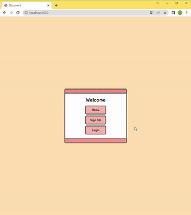

# Django 프로젝트12





### 1. 깃 저장소 생성

#### 1-1. 깃 저장소 생성

- 원격 저장소 생성
- 로컬 저장소 깃 초기화

```bash
$ git init
```

#### 1-2. .gitignore

> https://www.toptal.com/developers/gitignore/

```bash
$ touch .gitignore
```

#### 1-3. commit & push

- commit : `init`
- push : `master`


### 2. 개발환경 설정

#### 2-1. 가상환경 생성 및 실행

> 가상환경 : 프로젝트별 별도 패키지 관리

```bash
# 가상환경 생성
$ python -m venv venv

# 가상환경 폴더 생성 확인
$ ls

# 가상환경 실행
$ source venv/Scripts/activate
(venv)
```

#### 2-2. Django, 추가 패키지 설치 및 기록

> 가상환경 실행한 상태에서 패키지지 설치

```bash
# Django LTS 버전 설치
$ pip install django==3.2.13

# Django-Bootstrap5 설치
$ pip install django-bootstrap5

# Django-Extensions 설치
$ pip install django-extensions

# Pillow 설치
$ pip install Pillow

# PILkit(Pillow 헬퍼) 설치
$ pip install pilkit

# django-imagekit(썸네일 헬퍼 장고 앱) 설치
$ pip install django-imagekit

# 패키지 설치 확인
$ pip list

# 패키지 기록
$ pip freeze > requirements.txt
```

#### 2-3. Django 프로젝트 생성

```bash
# Django 프로젝트 생성
$ django-admin startproject config .

# 프로젝트 폴더 생성 확인
$ ls
```

#### 2-4. 패키지 등록

- `config/settings.py` 파일의 `INSTALLED_APPS`에 추가

```python
INSTALLED_APPS = [
    'django_bootstrap5',
    'django_extensions',
    'imagekit'
    ...
]
```


### 3. Template 및 Static Files 관리

#### 3-1 Templates 설정

- `config/templates` 폴더 생성 후, 템플릿 관리
- `config/settings.py` 파일의 `TEMLATES`의 `DIRS` 추가

```python
TEMPLATES = [
    {
        ...
        'DIRS': [BASE_DIR / 'config' / 'templates'],
        ...
    },
]
```

#### 3-2. STATIC files 설정

- `django.contrib.staticfiles`가 `config/settings.py` 파일의 `INSTALLED_APPS`에 포함되어 있는지 확인

```python
INSTALLED_APPS = [
    ...
    'django.contrib.staticfiles',
]
```

- `config/settings.py` 파일의 `INSTALLED_APPS`에 `STATIC_URL` 설정

```python
STATIC_URL = '/static/'
```

- `config/static/` 폴더 생성 후, 정적 파일 폴더별 관리
- 기본 경로를 제외하고 추가적인 정적 파일 경로 목록 정의 : `STATICFILES_DIRS`

```python
import os

...

STATIC_URL = '/static/'
STATICFILES_DIRS = [os.path.join(BASE_DIR, "config", "static")]
```

- `static/css` 폴더 생성 후, css 파일 관리

#### 3-3. 기본 Templates 관리

- `templates/base.html` 파일 생성

```bash



<!DOCTYPE html>
<html lang="en">

  <head>
    <meta charset="UTF-8">
    <meta http-equiv="X-UA-Compatible" content="IE=edge">
    <meta name="viewport" content="width=device-width, initial-scale=1.0">
    
    
    
    <link rel="stylesheet" href="https://cdn.jsdelivr.net/npm/bootstrap-icons@1.9.1/font/bootstrap-icons.css">
    <link rel="stylesheet" href="">
    <title>Document</title>
  </head>

  <body>
    
  </body>

</html>
```

- `templates/header.html` 파일 생성

```html
<div class="m-0 p-0 color-3 bd-bottom">
  <nav class="navbar navbar-expand-lg">
    <div class="container-fluid">
      <a class="navbar-brand" href="">SUGAR HIGH</a>
      <button class="navbar-toggler" type="button" data-bs-toggle="collapse" data-bs-target="#navbarNav" aria-controls="navbarNav" aria-expanded="false" aria-label="Toggle navigation">
        <span class="navbar-toggler-icon"></span>
      </button>
      <div class="collapse navbar-collapse" id="navbarNav">
        <ul class="navbar-nav">
          <li class="nav-item">
            <a class="nav-link active" aria-current="page" href="">Home</a>
          </li>
          
            <li class="nav-item">
              <a class="nav-link" href="">Logout</a>
            </li>
            <li class="nav-item">
              <a class="nav-link" href="">{{ user }}</a>
            </li>
          
            <li class="nav-item">
              <a class="nav-link" href="">Sign Up</a>
            </li>
            <li class="nav-item">
              <a class="nav-link" href="">Login</a>
            </li>
          
        </ul>
      </div>
    </div>
  </nav>
</div>
```

- 필요한 위치에 넣어 활용

```html

```


### 4. 시작 페이지

#### 4-1. URL 설정

- `config/urls.py` 파일에 추가

```python
from django.contrib import admin
from django.urls import path
from . import views

urlpatterns = [
    path('admin/', admin.site.urls),
    path('', views.index, name='index'),
]
```

#### 4-2. View 설정

- `config/views.py` 파일 생성

```python
from django.shortcuts import render

def index(request):

    return render(request, 'index.html')
```

#### 4-3. html 작성

- `config/templates/index.html` 파일 생성

```html




  <div class="min-box m-auto">
    <div class="card text-center bd">
      <div class="card-header color-3"></div>
      <div class="card-body bd-body">
        <h3 class="card-title">Welcome</h3>
        <div class="box">
          <a href="#" class="btn min-btn color-2 bd">Home</a>
          <a href="#" class="btn min-btn color-2 bd">Sing Up</a>
          <a href="#" class="btn min-btn color-2 bd">Login</a>
        </div>
      </div>
      <div class="card-footer color-3"></div>
    </div>
  </div>

```


### 5. accounts App

#### 5-1. App 생성

```bash
# Django 앱 생성
$ python manage.py startapp accounts
```

#### 5-2. App 등록

- `config/settings.py` 파일의 `INSTALLED_APPS`에 추가

```python
INSTALLED_APPS = [
    'accounts',
    ...
]
```

#### 5-3. URL 설정

> app 단위의 URL 관리

- `config/urls.py` 파일에 추가

```python
from django.contrib import admin
from django.urls import path, include
from . import views

urlpatterns = [
    path('admin/', admin.site.urls),
    path('', views.index, name='index'),
    path('accounts/', include('accounts.urls')),
]
```

- `accounts/urls.py` 파일 생성

```python
from django.urls import path
from . import views

app_name = 'accounts'

urlpatterns = [

]
```

#### 5-4. Templates 관리

- `accounts/templates/accounts` 폴더 생성 후, 템플릿 관리


### 6. User Model 정의

> Django AbstractUser 모델 상속

#### 6-1. 클래스 정의

- `accounts/models.py` 파일에 클래스 추가

```python
from django.db import models
from django.contrib.auth.models import AbstractUser

class User(AbstractUser):
    followings = models.ManyToManyField('self', symmetrical=False, related_name='followers')
```

#### 6-2. User Model 등록

- `config/settings.py` 파일에  `AUTH_USER_MODEL` 추가

```python
# User Model
AUTH_USER_MODEL = 'accounts.User'
```

#### 6-3. 마이그레이션 파일 생성

- `accounts/migrations` 폴더에 생성된 파일 확인

```bash
$ python manage.py makemigrations
```

#### 6-4. DB 반영

```bash
$ python manage.py migrate
```


### 7. 회원 CRUD 기능 구현

#### 7-1. 회원가입 기능

##### (1) CustomUserCreationForm 생성

- `accounts/forms.py` 파일 생성

```python
from django.contrib.auth.forms import UserCreationForm
from django.contrib.auth import get_user_model

class CustomUserCreationForm(UserCreationForm):
    class Meta:
        model = get_user_model()
        fields = ('username', 'password1', 'password2', 'email', 'first_name', 'last_name',)
```

##### (2) URL 설정

- `accounts/urls.py` 파일에 URL 설정

```python
from django.urls import path
from . import views

app_name = 'accounts'

urlpatterns = [
    path('signup/',  views.signup, name='signup'),
]
```

##### (3) View 설정

- `accounts/views.py` 파일에 임포트 추가 및 함수 생성

```python
from django.shortcuts import render, redirect
from .forms import CustomUserCreationForm

def signup(request):
    if request.method == 'POST':
        form = CustomUserCreationForm(request.POST)
        if form.is_valid():
            form.save()
            return redirect('index')
    else:
        form = CustomUserCreationForm()
    context = {
        'form':form
    }
    return render(request, 'accounts/signup.html', context)
```

##### (4) html 작성

- `accounts/signup.html` 파일 생성

```html




  <div class="min-box m-auto">
    <div class="card text-center bd">
      <div class="card-header color-3"></div>
      <div class="card-body bd-body">
        <h3 class="card-title">Sign Up</h3>
        <form action="" method="POST" class="mt-3">
          
          
          <input class="btn min-btn color-2 bd" type="submit" value="Enter">
        </form>
      </div>
      <div class="card-footer color-3"></div>
    </div>
  </div>

```

##### (4)  페이지 연결

```html

```

#### 7-2. 로그인 기능

##### (1) URL 설정

- `accounts/urls.py` 파일에 URL 설정

```python
from django.urls import path
from . import views

app_name = 'accounts'

urlpatterns = [
    path('signup/',  views.signup, name='signup'),
    path('login/', views.login, name='login'),
]
```

##### (2) View 설정

- `accounts/views.py` 파일에 임포트 추가 및 함수 생성

```python
...
from django.contrib.auth.forms import AuthenticationForm
from django.contrib.auth import login as auth_login

...

def login(request):
    if request.method == 'POST':
        form = AuthenticationForm(request, data=request.POST)
        if form.is_valid():
            auth_login(request, form.get_user())
            return redirect('index')
    else:
        form = AuthenticationForm()
    context = {
        'form': form
    }
    return render(request, 'accounts/login.html', context)
```

##### (3) html 작성

- `accounts/login.html` 파일 생성

```html




  <div class="min-box m-auto">
    <div class="card text-center bd">
      <div class="card-header color-3"></div>
      <div class="card-body bd-body">
        <h3 class="card-title">Login</h3>
        <form action="" method="POST" class="mt-3">
          
          
          <input class="btn min-btn color-2 bd" type="submit" value="Enter">
        </form>
      </div>
      <div class="card-footer color-3"></div>
    </div>
  </div>

```

##### (4)  페이지 연결

```html

```

#### 7-3. 로그아웃 기능

##### (1) URL 설정

- `accounts/urls.py` 파일에 URL 설정

```python
from django.urls import path
from . import views

app_name = 'accounts'

urlpatterns = [
    path('signup/', views.signup, name='signup'),
    path('login/', views.login, name='login'),
    path('logout/', views.logout, name='logout'),
]
```

##### (2) View 설정

- `accounts/views.py` 파일에 임포트 추가 및 함수 생성

```python
...
from django.contrib.auth import logout as auth_logout
from django.contrib.auth.decorators import login_required

...

@login_required
def logout(request):
    auth_logout(request)
    return redirect('index')
```

##### (3)  페이지 연결

```html

```

#### 7-4. 회원 상세정보 기능

##### (1) URL 설정

- `accounts/urls.py` 파일에 URL 설정

```python
from django.urls import path
from . import views

app_name = 'accounts'

urlpatterns = [
    path('signup/', views.signup, name='signup'),
    path('login/', views.login, name='login'),
    path('logout/', views.logout, name='logout'),
    path('<int:user_pk>/', views.detail, name='detail'),
]
```

##### (2) View 설정

- `accounts/views.py` 파일에 임포트 추가 및 함수 생성

```python
from django.shortcuts import render, redirect, get_object_or_404
...
from django.contrib.auth import get_user_model

...

def detail(request, user_pk):
    user = get_object_or_404(get_user_model(), pk=user_pk)
    context = {
        'user': user
    }
    return render(request, 'accounts/detail.html', context)
```

##### (3) html 작성

- `accounts/detail.html` 파일 생성

```html




  <div class="min-box my-auto">
    <div class="row">
      <div class="col-10">
        <div class="card text-center bd">
          
          <div class="card-body bd-bottom">
            <h3 class="card-title">{{ user }}'S INFO</h3>
            <div class="row">
              <div class="col-1"></div>
              <div class="col-3">
                
                <div class="row mt-2">
                  <div class="col-3">
                    
                      <a class="display-5" href="">
                        
                          <i class="bi bi-star-fill"></i>
                        
                          <i class="bi bi-star"></i>
                        
                      </a>
                    
                      <i class="bi bi-star-fill display-5"></i>
                    
                  </div>
                  <div class="col-9 box">
                    <span class="m-0">
                      following
                      {{ user.followings.count }}
                    </span>
                    <span>
                      follower
                      {{ user.followers.count }}
                    </span>
                  </div>
                </div>
              </div>
              <div class="col-7 color-1 bd py-3">
                <dl class="row m-2">
                  <dt class="col-sm-3 text-center">username</dt>
                  <dd class="col-sm-9">{{ user.username }}</dd>
                  <dt class="col-sm-3 text-center">joined</dt>
                  <dd class="col-sm-9">{{ user.date_joined }}</dd>
                  <dt class="col-sm-3 text-center">email</dt>
                  <dd class="col-sm-9">{{ user.email }}</dd>
                  <dt class="col-sm-3 text-center">last name</dt>
                  <dd class="col-sm-9">{{ user.last_name }}</dd>
                  <dt class="col-sm-3 text-center">first name</dt>
                  <dd class="col-sm-9">{{ user.first_name }}</dd>
                </dl>
              </div>
              <div class="col-1"></div>
            </div>
          </div>
          <div class="card-footer color-3"></div>
        </div>
      </div>
      <div class="col-2">
        <div class="box">
          <a href="" class="btn min-btn w-75 color-1 bd">Home</a>
          
            <a href="" class="btn min-btn w-75 color-2 bd">Logout</a>
          
            <a href="" class="btn min-btn w-75 color-2 bd">Sign Up</a>
            <a href="" class="btn min-btn w-75 color-2 bd">Login</a>
          
        </div>
      </div>
    </div>
  </div>

```

#### 7-5. 팔로우 기능

##### (1) URL 설정

- `accounts/urls.py` 파일에 URL 설정

```python
from django.urls import path
from . import views

app_name = 'accounts'

urlpatterns = [
    path('signup/', views.signup, name='signup'),
    path('login/', views.login, name='login'),
    path('logout/', views.logout, name='logout'),
    path('<int:user_pk>/', views.detail, name='detail'),
    path('<int:user_pk>/follow/', views.follow, name='follow'),
]
```

##### (2) View 설정

- `accounts/views.py` 파일에 함수 추가

```python
...
from django.contrib import messages

...
@login_required
def follow(request, user_pk):
    user = get_user_model().objects.get(pk=user_pk)
    if request.user == user:
        messages.warning(request, '스스로 팔로우 할 수 없습니다.')
        return redirect('accounts:detail', user_pk)
    if request.user in user.followers.all():
        user.followers.remove(request.user)
    else:
        user.followers.add(request.user)
    return redirect('accounts:detail', user_pk)
```

##### (3)  페이지 연결

```html

```


### 8. reviews App

#### 8-1. App 생성

```bash
# Django 앱 생성
$ python manage.py startapp reviews
```

#### 8-2. App 등록

- `config/settings.py` 파일의 `INSTALLED_APPS`에 추가

```python
INSTALLED_APPS = [
    'reviews',
    ...
]
```

#### 8-3. URL 설정

> app 단위의 URL 관리

- `config/urls.py` 파일에 추가

```python
from django.contrib import admin
from django.urls import path, include
from . import views

urlpatterns = [
    path('admin/', admin.site.urls),
    path('', views.index, name='index'),
    path('accounts/', include('accounts.urls')),
    path('reviews/', include('reviews.urls')),
]
```

- `reviews/urls.py` 파일 생성

```python
from django.urls import path
from . import views

app_name = 'reviews'

urlpatterns = [
    path('', views.index, name='index'),
]
```

#### 8-4. View 설정

- `reviews/views.py` 파일에 함수 생성

```python
from django.shortcuts import render

def index(request):

    return render(request, 'reviews/index.html')
```

#### 8-5. Templates 관리

- `reviews/templates/reviews` 폴더 생성 후, 템플릿 관리
- `reviews/index.html` 파일 생성

```html




  <main class="container bg-white bd p-0">
    
  </main>

```


### 9. Review Model 정의

#### 9-1. 클래스 정의

- `reviews/models.py` 파일에 클래스 추가

```python
from django.db import models
from django.conf import settings

class Review(models.Model):
    title = models.CharField(max_length=80)
    cafe_name = models.CharField(max_length=80)
    content = models.TextField()
    image = models.ImageField(upload_to='images/', blank=True)
    grade_choices = (
        (1, '★'),
        (2, '★★'),
        (3, '★★★'),
        (4, '★★★★'),
        (5, '★★★★★'),
    )
    grade = models.IntegerField(choices=grade_choices)
    created_at = models.DateField(auto_now_add=True)
    updated_at = models.DateField(auto_now=True)
    user = models.ForeignKey(settings.AUTH_USER_MODEL, on_delete=models.CASCADE)
    like_users = models.ManyToManyField(settings.AUTH_USER_MODEL, related_name='like_reviews')
```

#### 9-2. 마이그레이션 파일 생성

- `reviews/migrations` 폴더에 생성된 파일 확인

```bash
$ python manage.py makemigrations
```

#### 9-3. DB 반영

```bash
$ python manage.py migrate
```


### 10. 리뷰 CRUD 기능 구현

#### 10-1. 리뷰 작성 기능

##### (1) ModelForm 선언

- `reviews/forms.py` 파일 생성

```python
from django import forms
from .models import Review

class ReviewForm(forms.ModelForm):
    class Meta:
        model = Review
        fields = ['title', 'cafe_name', 'content', 'grade', 'image']
```

##### (2) Media 설정

- `config/settings.py` 파일에 `MEDIA_ROOT`, `MEDIA_URL` 설정

```python
MEDIA_ROOT = BASE_DIR / 'reviews'
MEDIA_URL = '/media/'
```

- `config/urls.py` 파일에 업로드 한 미디어 파일 제공

```python
...
from django.conf import settings
from django.conf.urls.static import static

urlpatterns = [
    ...
] + static(settings.MEDIA_URL, document_root=settings.MEDIA_ROOT)
```

##### (3) URL 설정

- `reviews/urls.py` 파일에 URL 설정

```python
from django.urls import path
from . import views

app_name = 'reviews'

urlpatterns = [
    path('', views.index, name='index'),
    path('create/', views.create, name='create'),
]
```

##### (4) View 설정

- `reviews/views.py` 파일에 임포트 추가 및 함수 생성

```python
from django.shortcuts import render, redirect
from django.contrib.auth.decorators import login_required
from .forms import ReviewForm

...

@login_required
def create(request):
    if request.method == 'POST':
        review_form = ReviewForm(request.POST, request.FILES)
        if review_form.is_valid():
            review = review_form.save(commit=False)
            review.user = request.user
            review.save()
            return redirect('reviews:index')
    else:
        review_form = ReviewForm()
    context = {
        'review_form': review_form
    }
    return render(request, 'reviews/form.html', context=context)
```

##### (5) html 작성

- `reviews/form.html` 파일 생성

```html




  <div class="min-box m-auto">
    <div class="card text-center bd">
      <div class="card-header color-3"></div>
      <div class="card-body bd-body">
        <h3 class="card-title">
          
            New Review
          
            Edit Review
          
        </h3>
        <form action="" method="POST" enctype="multipart/form-data" class="mt-3">
          
          
          <input class="btn min-btn color-2 bd" type="submit" value="Enter">
        </form>
      </div>
      <div class="card-footer color-3"></div>
    </div>
  </div>

```

#### 10-2. 게시글 목록 기능

##### (1) View 설정

- `reviews/views.py` 파일에 임포트 추가 및 함수 수정

```python
from django.views.decorators.http import require_POST, require_safe
...
from .models import Review

def index(request):
    reviews = Review.objects.order_by('-pk')
    context = {
        'reviews': reviews
    }
    return render(request, 'reviews/index.html', context)
```

##### (2) html 작성

- `reviews/index.html` 파일 수정

```html




  <div class="min-box my-auto">
    <div class="row">
      <div class="col-10">
        <div class="card text-center bd">
          
          <div class="card-body bd-bottom">
            <h3 class="card-title">{{ user }}'S INFO</h3>
            <div class="row">
              <div class="col-1"></div>
              <div class="col-3">
                
                <div class="row mt-2">
                  <div class="col-3">
                    
                      <a class="display-5" href="">
                        
                          <i class="bi bi-star-fill"></i>
                        
                          <i class="bi bi-star"></i>
                        
                      </a>
                    
                      <i class="bi bi-star-fill display-5"></i>
                    
                  </div>
                  <div class="col-9 box">
                    <span class="m-0">
                      following
                      {{ user.followings.count }}
                    </span>
                    <span>
                      follower
                      {{ user.followers.count }}
                    </span>
                  </div>
                </div>
              </div>
              <div class="col-7 color-1 bd py-3">
                <dl class="row m-2">
                  <dt class="col-sm-3 text-center">username</dt>
                  <dd class="col-sm-9">{{ user.username }}</dd>
                  <dt class="col-sm-3 text-center">joined</dt>
                  <dd class="col-sm-9">{{ user.date_joined }}</dd>
                  <dt class="col-sm-3 text-center">email</dt>
                  <dd class="col-sm-9">{{ user.email }}</dd>
                  <dt class="col-sm-3 text-center">last name</dt>
                  <dd class="col-sm-9">{{ user.last_name }}</dd>
                  <dt class="col-sm-3 text-center">first name</dt>
                  <dd class="col-sm-9">{{ user.first_name }}</dd>
                </dl>
              </div>
              <div class="col-1"></div>
            </div>
          </div>
          <div class="card-footer color-3"></div>
        </div>
      </div>
      <div class="col-2">
        <div class="box">
          <a href="" class="btn min-btn w-75 color-1 bd">Home</a>
          
            <a href="" class="btn min-btn w-75 color-2 bd">Logout</a>
          
            <a href="" class="btn min-btn w-75 color-2 bd">Sign Up</a>
            <a href="" class="btn min-btn w-75 color-2 bd">Login</a>
          
        </div>
      </div>
    </div>
  </div>

```

##### (3) 페이지 연결

```html

```

#### 10-3. 게시글 상세보기 기능

##### (1) URL 설정

- `reviews/urls.py` 파일에 URL 설정

```python
from django.urls import path
from . import views

app_name = 'reviews'

urlpatterns = [
    path('', views.index, name='index'),
    path('create/', views.create, name='create'),
    path('<int:review_pk>/', views.detail, name='detail'),
]
```

##### (2) View 설정

- `reviews/views.py` 파일에 함수 생성

```python
from django.shortcuts import render, redirect, get_object_or_404
...

def detail(request, review_pk):
    review = get_object_or_404(Review, pk=review_pk)
    context = {
        'review': review
    }
    return render(request, 'reviews/detail.html', context)
```

##### (3) html 작성

- `reviews/detail.html` 파일 생성

```html




  <main class="container bg-white bd p-0">
    
    <div class="box p-4 p-md-5 m-4 ">
      <h1 class="text-center">
        No.{{ review.pk }}
        :
        {{ review.title }}
      </h1>
      <h5 class="w-100 text-end">
        <a href="">
          {{ review.user.username }}
        </a>
      </h5>
      <div class="w-100">
        <div class="row">
          <div class="col-5">
            
          </div>
          <div class="col-7 my-auto">
            <dl class="row">
              <dt class=" col-sm-3 text-center">title</dt>
              <dd class="col-sm-9">{{ review.title }}</dd>
              <dt class=" col-sm-3 text-center">cafe_name</dt>
              <dd class="col-sm-9">{{ review.cafe_name }}</dd>
              <dt class=" col-sm-3 text-center">grade</dt>
              <dd class="col-sm-9">
                {{ review.get_grade_display }}
                {{ review.grade }}
              </dd>
              <dt class="col-sm-3 text-center">content</dt>
              <dd class="col-sm-9">{{ review.content }}</dd>
              <dt class=" col-sm-3 text-center">username</dt>
              <dd class="col-sm-9">{{ review.user.username }}</dd>
              <dt class="col-sm-3 text-center">created_at</dt>
              <dd class="col-sm-9">{{ review.created_at | date:"Y-m-d" }}</dd>
              <dt class="col-sm-3 text-center">updated_at</dt>
              <dd class="col-sm-9">{{ review.updated_at | date:"Y-m-d" }}</dd>
            </dl>
          </div>
        </div>
      </div>
      <div class="w-100 d-flex justify-content-end">
        
          
            <a class="btn min-btn color-1 bd m-1 px-3" href="">Edit</a>
            <a class="btn min-btn color-2 bd m-1 px-3" href="">Delete</a>
          
        
      </div>
    </div>
  </main>

```

##### (4) 페이지 연결

```html

```

#### 10-4. 게시글 수정 기능

##### (1) URL 설정

- `reviews/urls.py` 파일에 URL 설정

```python
from django.urls import path
from . import views

app_name = 'reviews'

urlpatterns = [
    path('', views.index, name='index'),
    path('create/', views.create, name='create'),
    path('<int:review_pk>/', views.detail, name='detail'),
    path('<int:review_pk>/update/', views.update, name='update'),
]
```

##### (2) View 설정

- `reviews/views.py` 파일에 함수 생성

```python
...
from django.contrib import messages

@login_required
def update(request, review_pk):
    review = get_object_or_404(Review, pk=review_pk)
    if request.user == review.user: 
        if request.method == 'POST':
            review_form = ReviewForm(request.POST, request.FILES, instance=review)
            if review_form.is_valid():
                review_form.save()
                return redirect('reviews:detail', review.pk)
        else:
            review_form = ReviewForm(instance=review)
        context = {
            'review_form': review_form
        }
        return render(request, 'reviews/form.html', context)
    else:
        messages.warning(request, '작성자만 수정할 수 있습니다.')
        return redirect('reviews:detail', review.pk)
```

##### (3) 페이지 연결

```html

```

#### 10-5. 게시글 삭제 기능

##### (1) URL 설정

- `reviews/urls.py` 파일에 URL 설정

```python
from django.urls import path
from . import views

app_name = 'reviews'

urlpatterns = [
    path('', views.index, name='index'),
    path('create/', views.create, name='create'),
    path('<int:review_pk>/', views.detail, name='detail'),
    path('<int:review_pk>/update/', views.update, name='update'),
    path('<int:review_pk>/delete/', views.delete, name='delete'),
]
```

##### (2) View 설정

- `reviews/views.py` 파일에 함수 생성

```python
...

@login_required
def delete(request, review_pk):
    review = get_object_or_404(Review, pk=review_pk)
    review.delete()
    return redirect('reviews:index')
```

##### (3) 페이지 연결

- `reviews/detail.html` 파일에 추가

```html

```

#### 10-6. 회원 게시글 목록 기능

##### (1) html 작성

- `accounts/detail.html` 파일에 추가

```html
      <div class="col-4">
        <div class="card text-center bd">
          <div class="card-header color-3">
            <p class="card-title text-center m-0">
              {{ user.review_set.count }}
              Reviews
            </p>
          </div>
          <div class="card-body bd-body text-start">
            
              <div class="w-100 my-1">
                <a class="text-dark my-1" href="">
                  No.{{ forloop.counter }}
                  {{ review.title }}
                </a>
              </div>
            
          </div>
          <div class="card-footer color-3"></div>
        </div>
```

#### 10-7. 게시글 좋아요 기능

##### (1) URL 설정

- `reviews/urls.py` 파일에 URL 설정

```python
from django.urls import path
from . import views

app_name = 'reviews'

urlpatterns = [
    path('', views.index, name='index'),
    path('create/', views.create, name='create'),
    path('<int:review_pk>/', views.detail, name='detail'),
    path('<int:review_pk>/update/', views.update, name='update'),
    path('<int:review_pk>/delete/', views.delete, name='delete'),
    path('<int:review_pk>/like/', views.like, name='like'),
]
```

##### (2) View 설정

- `reviews/views.py` 파일에 함수 추가

```python
...
@login_required
def like(request, review_pk):
    review = get_object_or_404(Review, pk=review_pk)
    if request.user in review.like_users.all():
        review.like_users.remove(request.user)
    else:
        review.like_users.add(request.user)
    return redirect('reviews:detail', review_pk)
```

##### (3) html 작성

- `reviews/detail.html` 파일 수정

```html
...
      <div class="w-100 d-flex justify-content-end">
        
          <p class="fs-3 lh-2 m-1 px-3">
            <a href="">
              
                <i class="bi bi-heart-fill text-danger"></i>
              
                <i class="bi bi-heart text-danger"></i>
              
            </a>
            {{ review.like_users.count }}
          </p>
          ...
        
          <p class="fs-3 lh-2 m-1 px-3">
            <i class="bi bi-heart-fill text-danger"></i>
            {{ review.like_users.count }}
          </p>
        
      </div>
...
```

- `accounts/detail.html` 파일 수정

```html
      <div class="col-4">
        <div class="card text-center bd">
          <div class="card-header color-3">
            <p class="card-title text-center m-0">
              {{ user.like_reviews.count }}
              Likes
            </p>
          </div>
          <div class="card-body bd-body text-start">
            
              <div class="w-100 my-1">
                <a class="text-dark my-1" href="">
                  No.{{ forloop.counter }}
                  {{ review.title }}
                </a>
              </div>
            
          </div>
          <div class="card-footer color-3"></div>
        </div>
      </div>
```


### 11. Comment Model 정의 

#### 11-1. 클래스 정의

- `reviews/models.py` 파일에 클래스 추가

```python
...

class Comment(models.Model):
    content = models.TextField(max_length=80)
    created_at = models.DateTimeField(auto_now_add=True)
    review = models.ForeignKey(Review, on_delete=models.CASCADE)
    user = models.ForeignKey(settings.AUTH_USER_MODEL, on_delete=models.CASCADE)
```

#### 11-2. 마이그레이션 파일 생성

- `reviews/migrations` 폴더에 생성된 파일 확인

```bash
$ python manage.py makemigrations
```

#### 11-3. DB 반영

```bash
$ python manage.py migrate
```


### 12. 댓글 CRUD 기능 구현

#### 12-1. 댓글 작성 기능

##### (1) ModelForm 선언

- `reviews/forms.py` 파일에 추가

```python
...
from .models import Review, Comment

...

class CommentForm(forms.ModelForm):
    class Meta:
        model = Comment
        fields = ['content',]
        widgets = {
            'content': forms.Textarea(attrs={'rows': 2})
        }
```

##### (2) URL 설정

- `reviews/urls.py` 파일에 URL 설정

```python
from django.urls import path
from . import views

app_name = 'reviews'

urlpatterns = [
    path('', views.index, name='index'),
    path('create/', views.create, name='create'),
    path('<int:review_pk>/', views.detail, name='detail'),
    path('<int:review_pk>/update/', views.update, name='update'),
    path('<int:review_pk>/delete/', views.delete, name='delete'),
    path('<int:review_pk>/like/', views.like, name='like'),
    path('<int:review_pk>/comments/', views.comment_create, name='comment_create'),
]
```

##### (3) View 설정

- `reviews/views.py` 파일에 함수 수정

```python
...
from .forms import ReviewForm, CommentForm

...

def detail(request, review_pk):
    review = get_object_or_404(Review, pk=review_pk)
    comment_form = CommentForm()
    context = {
        'review': review,
        'comment_form': comment_form
    }
    return render(request, 'reviews/detail.html', context)
```

- `reviews/views.py` 파일에 함수 생성

```python
...

@login_required
def comment_create(request, review_pk):
    review = get_object_or_404(Review, pk=review_pk)
    comment_form = CommentForm(request.POST)
    if comment_form.is_valid():
        comment = comment_form.save(commit=False)
        comment.review = review
        comment.user = request.user
        comment.save()
    return redirect('reviews:detail', review.pk)
```

##### (4) html 작성

- `reviews/detail.html` 파일 생성

```html
    <div class="box px-4 px-md-5 m-4 mt-0">
      <form class="w-100" action="" method="POST">
        
        
        <div class="w-100 d-flex justify-content-end">
          <input class="btn btn-sm color-1 bd m-1 px-3" type="submit" value="Enter">
        </div>
      </form>
    </div>
```

#### 12-2. 댓글 목록 기능

##### (1) View 설정

- `reviews/views.py` 파일에 임포트 추가 및 함수 수정

```python
...

def detail(request, review_pk):
    review = Review.objects.get(pk=review_pk)
    comment_form = CommentForm()
    comments = review.comment_set.all()
    context = {
        'review': review,
        'comment_form': comment_form,
        'comments': comments
    }
    return render(request, 'reviews/detail.html', context)
```

##### (2) html 작성

- `reviews/detail.html` 파일 수정

```html
    <div class="box px-4 px-md-5 m-4 mt-0">
      
        <div class="card text-center bd w-100">
          <div class="card-header color-2">
            <p class="card-title text-center m-0">
              {{ comments|length }}
              Comments
            </p>
          </div>
          <div class="card-body bd-body text-start">
            <div class="w-100 my-1">
              <div class="row p-1 w-100">
                <div class="col-2">
                  <p class="my-1">{{ comment.user.username }}</p>
                </div>
                <div class="col-9">
                  <p class="my-1">{{ comment.content }}</p>
                </div>
                <div class="col-1">
                  
                    
                      <a class="btn btn-sm bd color-3" href="#">
                        <i class="bi bi-trash3-fill"></i>
                      </a>
                    
                  
                </div>
              </div>
            </div>
          </div>
          <div class="card-footer color-2"></div>
        </div>
        
        <p class="text-center my-1 text-muted">Nothing Here...</p>
      
    </div>
```

#### 12-3. 댓글 삭제 기능

##### (1) URL 설정

- `reviews/urls.py` 파일에 URL 설정

```python
from django.urls import path
from . import views

app_name = 'reviews'

urlpatterns = [
    path('', views.index, name='index'),
    path('create/', views.create, name='create'),
    path('<int:review_pk>/', views.detail, name='detail'),
    path('<int:review_pk>/update/', views.update, name='update'),
    path('<int:review_pk>/delete/', views.delete, name='delete'),
    path('<int:review_pk>/like/', views.like, name='like'),
    path('<int:review_pk>/comments/', views.comment_create, name='comment_create'),
    path('<int:review_pk>/comments/<int:comment_pk>/delete/', views.comment_delete, name='comment_delete'),
]
```

##### (2) View 설정

- `reviews/views.py` 파일에 함수 생성

```python
...
from .models import Review, Comment

...

@login_required
def comment_delete(request, review_pk, comment_pk):
    comment = get_object_or_404(Comment, pk=comment_pk)
    comment.delete()
    return redirect('articles:detail', review_pk)
```

##### (3) 페이지 연결

```html

```

#### 12-4. 회원 댓글 목록 기능

##### (1) html 작성

- `accounts/detail.html` 파일에 추가

```html
      <div class="col-4">
        <div class="card text-center bd">
          <div class="card-header color-2">
            <p class="card-title text-center m-0">
              {{ user.comment_set.count }}
              Comments
            </p>
          </div>
          <div class="card-body bd-body text-start">
            
              <div class="w-100 my-1">
                <a class="text-dark my-1" href="">
                  No.{{ forloop.counter }}
                  {{ comment.review.title }}
                </a>
              </div>
              
              <p class="text-center my-1 text-muted">Nothing Here...</p>
            
          </div>
          <div class="card-footer color-2"></div>
        </div>
      </div>
```

